  

  

### 👨‍💻 About Me
- 🚀 Full Stack Developer with **2+ years of professional experience** creating scalable web applications.
- ⚛️ Building modern applications using **React, Next.js, Node.js, Express.js, MongoDB, and TypeScript**.
- 🔐 Experienced in authentication, API development, payment gateway integration, analytics, and backend optimization.
- 🧩 Strong focus on clean architecture, reusable components, and maintainable code.
- 🤖 Experienced with AI-assisted development using **Cursor**, **Claude**, and **Antigravity**, enabling rapid SaaS product delivery while maintaining clean architecture and production-quality code.
- 🚀 Continuously learning and experimenting with modern software architecture, cloud technologies, AI-powered engineering, and scalable full-stack development.
- 💬 Tech I enjoy working with: `React` `Next.js` `Node.js` `Express` `MongoDB` `TypeScript` `Redux` `Tailwind CSS` `Stripe` `Zod`
- 🤝 Open to collaborating on innovative Full Stack and Open Source projects.
- ⚡ I enjoy turning complex ideas into fast, intuitive, and user-friendly digital experiences.

---
# 🚀 Featured Projects

## 📄 MD2PDFX — Client-Side Markdown to PDF Editor

A free, zero-friction, fully client-side Markdown editor that instantly converts your Markdown into beautifully themed, print-ready PDFs, HTML, or raw MD files. Built with developer workflows in mind, it requires no sign-ups or server uploads and works completely offline. 

### ✨ Highlights

- ⚡ Pro workspace with Edit, Split, and debounced Live Preview.
- 🔗 **Cloud Share & Live Updates:** Share your document easily via a link with a saved title, allowing for instant live updates and seamless syncing.
- 🎨 6 built-in premium PDF themes (Professional, Academic, Minimal, Creative, Dark, and Resume).
- 🧜‍♀️ Native Mermaid.js integration & comprehensive LaTeX support.
- 🔒 Privacy-first & fully offline operation (data stays completely on your local machine).
- 📂 Multi-format export options (PDF, HTML, and .md files).
- 📝 20+ built-in content snippets to instantly scaffold out documents, code, and diagrams.

### 🔗 Live Links

- **Live App:** https://md2pdfx.vercel.app
- **Repository:** https://github.com/taherankhan/md2pdf

### 🛠 Tech Stack

React • TypeScript • Vite • Marked • jsPDF

---
### 🚀 Tech Stack & Tools

  

  
  
  
  
  
  
  

## 📈 Contribution Graph

  

---

## 🔥 GitHub Streak

  

---

## 💬 Let's Build Something Amazing

I'm always interested in discussing:

- SaaS Products
- AI Applications
- MERN Stack
- Next.js
- Open Source
  
### 🌐 Connect With Me

  
  

---

⭐ Thanks for visiting my profile!

If you like my work, consider following me and starring my repositories.

